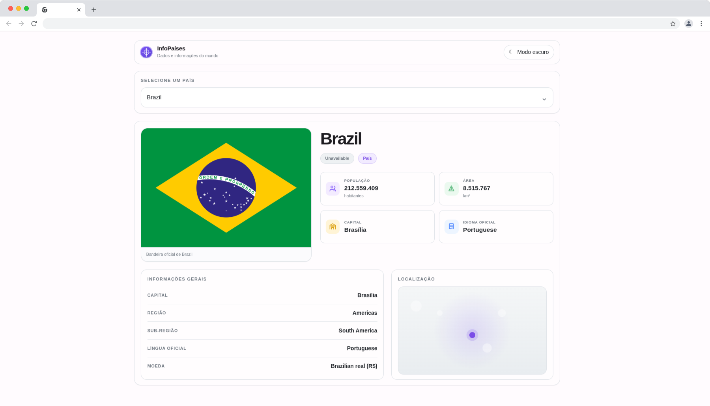
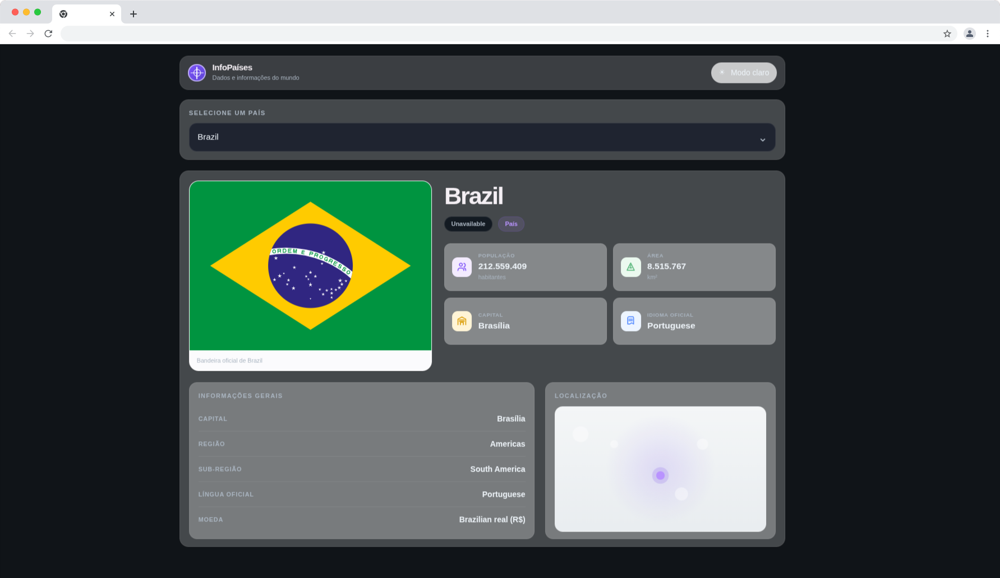

# 🌍 TMX Earth

> A beautiful, interactive web application to explore comprehensive information about any country in the world.

[](https://github.com/tjmelo/tmx-earth/releases)
[](LICENSE)
[](https://react.dev/)
[](https://www.typescriptlang.org/)

---

## ✨ Features

- 🔍 **Search & Filter** - Find any country from the comprehensive list
- 📊 **Rich Country Data** - Population, area, languages, currencies, time zones, and more
- 🎨 **Responsive Design** - Beautiful UI that works on desktop, tablet, and mobile
- ⚡ **Fast & Optimized** - Built with React 18 and optimized performance
- 🧪 **Well Tested** - Comprehensive test coverage with Jest and React Testing Library
- 📡 **Real-time Data** - Fetches country information from the migrated countries.dev endpoint, with resilient fallbacks for incomplete or unavailable payloads
- 🌐 **Live Demo** - Available on GitHub Pages

> The application keeps the browsing and detail experience stable after the country data source migration by normalizing missing provider values and surfacing clear loading/error feedback when data is temporarily unavailable.

## 🚀 Live Demo

👉 **[Preview TMX Earth Live](https://tjmelo.github.io/tmx-earth/)**




---

## 🛠️ Tech Stack

| Tool | Purpose |
|------|---------|
| **React 18** | UI framework |
| **TypeScript** | Type-safe development |
| **Redux** | State management |
| **Webpack 5** | Module bundler |
| **SCSS** | Styling |
| **Material-UI** | Component library |
| **Axios** | HTTP requests |
| **Jest & React Testing Library** | Testing |
| **GitHub Pages** | Deployment |

---

## 📋 Prerequisites

Before you begin, ensure you have:

- **Node.js** (v14 or higher)
- **npm** or **yarn** package manager
- **Git** (for cloning the repository)

---

## � Docker Setup (Optional)

### Option 1: Build Locally with Docker Compose

If you prefer using Docker, simply run:

```bash
# Clone the repository
git clone https://github.com/tjmelo/tmx-earth.git
cd tmx-earth

# Build and run with Docker
docker-compose up --build
```

The application will be available at `http://localhost:8080`

### Option 2: Pull from Docker Repository

Run the pre-built image directly from Docker Hub:

```bash
# Pull the image
docker pull tjmelo/tmx-earth:latest

# Run the container
docker run -p 8080:8080 tjmelo/tmx-earth:latest
```

Or use a specific version tag:

```bash
docker pull tjmelo/tmx-earth:1.3.0
docker run -p 8080:8080 tjmelo/tmx-earth:1.3.0
```

**Note:** Make sure you have Docker and Docker Compose installed on your system.

---

## 📦 Installation & Setup

### 1️⃣ Clone the Repository

```bash
git clone https://github.com/tjmelo/tmx-earth.git
cd tmx-earth
```

### 2️⃣ Install Dependencies

Using npm:
```bash
npm install
```

Or using yarn:
```bash
yarn install
```

### 3️⃣ Start Development Server

```bash
npm start
```

The application will open automatically at `http://localhost:8080`

---

## 🎯 Available Scripts

### Development

```bash
# Start development server with hot reload
npm start

# Run tests with coverage
npm test

# Check SCSS styling
npm run stylelint
```

### Production

```bash
# Build for production
npm run build

# Serve production build locally for testing
npm run serve

# Deploy to GitHub Pages
npm run predeploy
npm run deploy
```

---

## 📁 Project Structure

```
tmx-earth/
├── src/
│   ├── components/          # React components
│   │   ├── Countries/       # Country display component
│   │   ├── Load/            # Loading states
│   │   ├── Mount/           # List mounting logic
│   │   ├── Skeleton/        # Skeleton loaders
│   │   └── ListCountries.tsx # Main list component
│   ├── feature/             # Redux slices
│   │   └── country/         # Country state management
│   ├── service/             # API services
│   │   └── request.ts       # HTTP requests
│   ├── store/               # Redux store configuration
│   ├── styles/              # Global & component styles
│   ├── utils/               # Helper functions
│   ├── interfaces/          # TypeScript types
│   ├── constants/           # Application constants
│   └── App.tsx              # Root component
├── config/                  # Webpack configuration
├── public/                  # Static assets
├── docs/                    # Detailed documentation
├── build/                   # Production build output
└── package.json             # Dependencies & scripts
```

---

## 🧪 Testing

### Run All Tests

```bash
npm test
```

### Test Coverage

Tests are automatically collected and coverage reports are generated:

```bash
npm test -- --collect-coverage
```

### Key Test Files

- `src/components/__tests__/` - Component tests
- `src/service/request.spec.ts` - API service tests

---

## 🏗️ Building & Deployment

### Build for Production

```bash
npm run build
```

This creates an optimized production build in the `build/` directory.

### Deploy to GitHub Pages

```bash
npm run deploy
```

The app will be deployed to `https://tjmelo.github.io/tmx-earth/`

### Local Testing of Production Build

```bash
npm run serve
```

Visit `http://localhost:3000` to test the production build locally.

---

## 🔧 Configuration Files

| File | Purpose |
|------|---------|
| `webpack.common.ts` | Common webpack configuration |
| `webpack.dev.ts` | Development-specific settings |
| `webpack.prod.ts` | Production-specific settings |
| `tsconfig.json` | TypeScript configuration |
| `compose.yml` | Docker compose setup |
| `Dockerfile` | Docker image definition |

---

## 📖 Documentation

For more detailed information, check out our comprehensive documentation:

| Document | Purpose |
|----------|---------|
| **[Project Analysis](docs/PROJECT_ANALYSIS.md)** | Architecture & design patterns |
| **[Development Guidelines](docs/DEVELOPMENT_GUIDELINES.md)** | Coding standards & best practices |
| **[Architecture Patterns](docs/ARCHITECTURE_PATTERNS.md)** | Features & roadmap |
| **[Quick Reference](docs/QUICK_REFERENCE.md)** | Commands & file locations |
| **[Documentation Hub](docs/DOCUMENTATION_HUB.md)** | Complete documentation index |

---

## 🔗 Resources Used

This project leverages a curated stack of libraries, tools and practices to deliver a fast, accessible and maintainable experience. Key resources and technologies used in this application:

- **React 18** — core UI framework
- **TypeScript** — static typing across the codebase
- **Redux** (application store) — state management for countries and UI state
- **Webpack 5** — bundling and build pipelines (`config/webpack.*.ts`)
- **SCSS / CSS Modules** — component-level styling and global themes
- **Material-UI (MUI)** — component library and theming
- **Axios** — HTTP client for API requests (`src/service/request.ts`)
- **Jest & React Testing Library** — unit and component tests (`src/**/__tests__`, `request.spec.ts`)
- **Coverage tooling** — test coverage reports (coverage/)
- **Docker & Docker Compose** — optional containerized development and deployment (`Dockerfile`, `compose.yml`)
- **GitHub Pages** — hosting the demo site
- **Style linting** — `stylelint` script for SCSS checks
- **Design tokens & theme system** — centralized theme in `src/styles/theme.ts` and `shadowStyles.ts`
- **Project specs & SDD artifacts** — `specs/` folder containing `spec.md`, `plan.md`, `tasks.md` used during development
- **Static assets & build output** — `public/` and `build/` folders for deployment artifacts

If you need a precise dependency list, check `package.json` for exact package names and versions.

## 🤖 AIDD & SDD in the development process

This project explicitly embraces both Specification-Driven Development (SDD) and AI-Influenced Design & Development (AIDD) practices to improve predictability, quality and iteration speed.

- **SDD (Specification-Driven Development):**
	- The `specs/` directory contains formal feature specifications, task breakdowns and research notes used to drive implementation (`spec.md`, `tasks.md`, `plan.md`).
	- SDD guided acceptance criteria, automated test scope and helped prioritize incremental work (small, testable deliverables).
	- Using SDD ensured the UI, API normalization and edge-case handling (data fallbacks) were explicitly defined before implementation.

- **AIDD (AI-Driven Design & Development):**
	- AIDD was used to augment designer and developer workflows: rapid prototyping of visual refresh ideas, generating suggestions for theme tokens and surfacing accessibility recommendations for components.
	- Practical AIDD touchpoints in the project include research & prototyping phases, iterative improvements to the Material theme, and drafting documentation and commit-level changelogs.
	- AIDD is treated as an assistant: outputs are reviewed by engineers/designers and integrated when they meet accessibility, performance and consistency checks.

Both SDD and AIDD contributed to a faster feedback loop: SDD provided clear requirements and testability, while AIDD accelerated ideation and repetitive tasks (design tokens, accessibility checks, documentation drafts).

## 🔧 Proposed Improvements

Short actionable ideas to improve the project further:

- **Add E2E tests (Cypress / Playwright)** — cover critical flows: search, select, and detail pages.
- **Accessibility audit & remediation** — automated axe checks in CI and manual WCAG review.
- **Internationalization (i18n)** — extract UI strings and add translations for multiple locales.
- **PWA support & offline cache** — enable basic offline experience for country browsing.
- **Visual regression tests** — catch unintended style regressions during UI changes.
- **Centralized design tokens** — formalize tokens (colors/spacing/typography) and publish a small design system package.
- **Performance budgets & monitoring** — add Lighthouse/GTM monitoring and enforce budgets in CI.
- **Stricter TypeScript rules** — enable `strict` mode and address type gaps incrementally.
- **CI pipeline improvements** — parallelize lint/test/build steps and publish coverage reports.
- **Storybook / component catalog** — isolate components for faster UI development and documentation.
- **API resilience** — add retry/backoff, caching or local fallback layers to make the app more robust to upstream downtime.

---


## 🤝 Contributing

We welcome contributions! Here's how to get started:

### Create a Feature Branch

```bash
git checkout -b feature/your-feature-name
```

### Follow Commit Guidelines

```bash
# Format: type: description
git commit -m "feat: add new feature"
git commit -m "fix: resolve bug"
git commit -m "docs: update documentation"
```

### Push & Create a Pull Request

```bash
git push origin feature/your-feature-name
```

Then create a Pull Request on GitHub with a clear description of your changes.

### Code Standards

- Use TypeScript for all new code
- Follow the existing code style
- Write tests for new features
- Update documentation as needed
- Ensure all tests pass before submitting PR

---

## 📞 Support & Issues

Found a bug or have a suggestion? 

👉 **[Open an Issue on GitHub](https://github.com/tjmelo/tmx-earth/issues)**

---

## 📄 License

This project is licensed under the **MIT License** - see the [LICENSE](LICENSE) file for details.

---

## 🙏 Acknowledgments

- 🌐 **[REST Countries API](https://restcountries.com/)** - Country data provider
- 🎨 **[Material-UI](https://mui.com/)** - Component library
- ⚛️ **[React](https://react.dev/)** - UI framework

---

## Material Design 3 Visual Refresh

We recently performed a Material Design 3-inspired visual refresh focused on theme tokens, spacing rhythm, and surface treatments. Validation steps and implementation notes are available in the feature docs: [specs/003-material-design-m3/quickstart.md](specs/003-material-design-m3/quickstart.md)

## 📊 Project Info

| Info | Detail |
|------|--------|
| **Version** | 1.3.0 |
| **Type** | React SPA |
| **API** | REST Countries v3.1 |
| **Hosting** | GitHub Pages |
| **Deployment** | GitHub Actions |

---

<div align="center">

**🔥 Happy coding! Feel free to contribute and make this project even better!**

[⬆ Back to top](#-tmx-earth)

</div>
